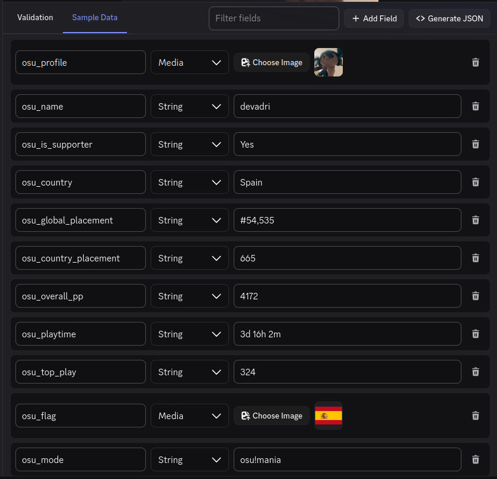

# osu-discord-widget

Tool for synchronizing your osu! profile data with a Discord Application Identity Profile (Profile Widget). Built for personal
use

# Example Widget Layout



# Requirements

To use this tool, you MUST have:

- Know how to create a Widget in Discord. Follow
  [**Chloe Cinders' Tutorial**](https://chloecinders.com/blog/discord-widgets) to learn how to do that.
- **osu! API Credentials** in order to fetch your profile data. Can be obtained in your
  [**osu! Account Settings**](https://osu.ppy.sh/home/account/edit#oauth). On the
  `OAuth` section, create a new `OAuth Application` (callback url doesn't matter)
  and copy the `Client ID` and `Client Secret`.
- **Discord App Credentials** in order to actually send your data over to discord. Obtained in the
  [**Discord Developer Portal**](https://discord.com/developers/applications). Create an application and get the
  `Application ID` and `Bot Token`

# Configuration

Copy `secrets.properties.example` to a new `secrets.properties` file, then fill it with all the required values
(everything except OSU_MODE is required)

# Warning
This tool has only been tested on Linux X64. There could be issues on other platforms

# Usage

To run the app you'll have to execute this command:

```bash
./gradlew runReleaseExecutablePLATFORM
```

Replacing PLATFORM with one of these:

- Linux X64 -> LinuxX64
- Linux arm64 -> LinuxArm64
- MacOS arm64 -> MacosArm64
- MacOS X64 -> MacosX64
- Windows -> MingwX64

# Credits

- JSON Parser ~~stolen~~ borrowed from [kotlin-simple-json](https://github.com/y9san9/kotlin-simple-json), licensed
  under [MIT License](https://github.com/y9san9/kotlin-simple-json/blob/master/LICENSE)